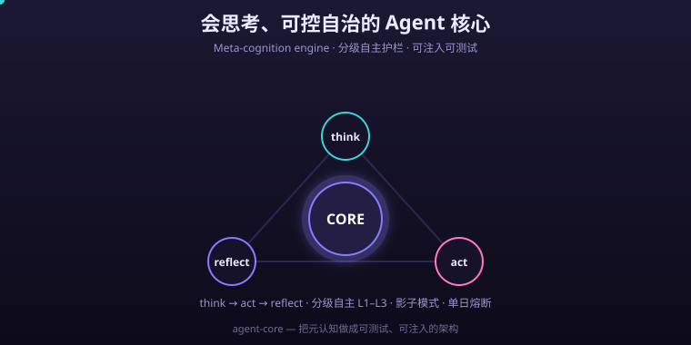

# @mox/agent-core

<p align="center">
  
  
  
  
  
  
</p>


> **A general-purpose Agent Core** — extracts the *metacognitive protocol engine* and *tiered-autonomy guardrails* from specific projects into **platform-agnostic, injectable, testable** code. Fits any scenario that needs "thinking + controllable autonomy": ops, R&D, data analysis, content production, customer support, automation…

<p>
  <a href="README.md">中文</a> ·
  <a href="https://codecloud-dev.github.io/agent-core/">📖 Docs (中/EN switch)</a>
</p>

<p align="center"></p>

<p>
  <b>⭐ If @mox/agent-core is useful to you, please give it a <a href="https://github.com/codecloud-dev/agent-core">Star</a> — it helps more developers adopt a thinking, controllable-autonomy Agent core!</b>
</p>

> Design philosophy: metacognition shouldn't be just a prompt — it should be **real architecture running inside the engine**. So reasoning chains, post-action self-checks, tool risk tiers, daily circuit breakers, and shadow mode are all built as testable, structured modules — platform-agnostic, usable by anyone via `npm i` or source import.

---

<details>
<summary>📑 Contents</summary>

- [🎯 What it solves](#what-it-solves)
- [📦 Installation](#installation)
- [🚀 Quick start](#quick-start)
- [🛠️ Ways to use it](#ways-to-use-it)
- [⚙️ Core concepts](#core-concepts)
- [🔹 Runtime abstraction (injectable)](#runtime-abstraction-injectable)
- [📚 Full API reference](#full-api-reference)
- [🗺️ Roadmap](#roadmap)
- [❓ FAQ](#faq)
- [🧪 Tests](#tests)
- [💖 Support us](#support-us)
- [📜 License](#license)

</details>

## 🎯 What it solves

- **Metacognition made explicit and enforceable**: `think` (reasoning card) / `reflect` (self-check card) are structured protocol actions the engine can render for humans, and it can *force* "reflect before finishing after a mutation".
- **Multi-action models don't drop calls anymore**: models often pack `think` and `call` into `[{think},{call}]`; naive implementations swallow the `call` into a fallback, yielding "thinks but does nothing". `normalizeActions` normalizes both single objects and arrays into an action array.
- **Tiered-autonomy guardrails**: three tool-risk tiers (low/mid/high) + a per-day autonomous-change circuit breaker + shadow mode (mid-risk is only simulated and reported). Makes "giving an AI permissions" controllable, observable, and reversible.
- **Zero platform lock-in**: no dependency on Cloudflare/Node/Vercel. Storage, action executor, and logging are all injected via interfaces. Ships three adapters — `D1Storage` (CF) / `MemoryStorage` (local & tests) / `NodeStorage` (Node files); any backend (Redis/Prisma/DynamoDB) follows the same template.

---

## 📦 Installation

### 📦 Option A: from source (always available right now)

```bash
git clone https://github.com/codecloud-dev/agent-core.git
cd agent-core
npm install                 # only pulls dev deps like esbuild / typescript
# bundle into a single file (no native deps; can be required directly or deployed to edge runtimes like Cloudflare Workers)
npm run build
```

### 📦 Option B: npm (ready since v1.0.0)

```bash
npm i @mox/agent-core
```

> Publish status: `package.json` is ready (`version: 1.0.0`, `prepublishOnly` builds automatically). A maintainer runs `npm publish` once to go live; afterwards the `npm i` above works. Docs and examples are already written for 1.0.0.

To bundle for edge runtimes (Cloudflare Workers, etc.), use esbuild/workerd (no native deps):

```bash
esbuild src/index.ts --bundle --format=esm --outfile=dist/index.js
```

---

## 🚀 Quick start

### 🔹 1. Metacognition: normalize actions + closed-loop gate

```ts
import { normalizeActions, ReflectGate, buildThink, buildReflect } from '@mox/agent-core';

// The model may return a single object, or an array (think+call packed)
const actions = normalizeActions(parsedModelOutput); // Action[]
const gate = new ReflectGate();
for (const a of actions) {
  if (a.action === 'think') renderReasonCard(a.reasoning);
  if (a.action === 'call')  { runTool(a.tool, a.args); gate.afterMutation(); }
  if (a.action === 'reflect') gate.onReflect();
  if (a.action === 'answer') send(a.text);
}
// before finishing, if gate.isPending -> reject and redo (loop rule: self-check first, then finish)
if (gate.isPending) reject('reflect before finishing');
```

### 🔹 2. Tiered guardrails: make autonomous execution controllable

```ts
import { guardExecute, defaultRemediationTier, isShadowMode } from '@mox/agent-core';
import { MemoryStorage } from '@mox/agent-core'; // zero-dep local/test; swap to D1Storage / NodeStorage in prod

const deps = {
  storage: new MemoryStorage(),   // anything implementing Storage works
  executor: {                    // the real remediation is executed by you
    async execute(tool, args) {
      return await runRemediation(tool, args);
    },
  },
  remediationTier: defaultRemediationTier,
  logger: { log: (lvl, kind, action, detail) => recordAudit(lvl, kind, action, detail) },
};

// daily quota exhausted -> blocked, never really executed
const gate = await checkDailyGate(deps);

// mid-risk action: if shadow mode is on -> only simulated & reported; otherwise really executes and counts quota
const res = await guardExecute(deps, 'disable_channel', { id: 7 });
if (res.blocked)    alert('today\'s autonomous-change quota is exhausted');
else if (res.simulated) reviewLater(res.summary); // shadow mode
else if (res.ok)     console.log('executed:', res.summary);
```

Run a real, runnable minimal example:

```bash
npx tsx examples/quickstart.ts
```

---

## 🛠️ Ways to use it

Same core — pick one integration for your runtime. Each below is a copy-paste snippet.

| Scenario | Import | Storage adapter | Key point |
|----------|--------|-----------------|-----------|
| Node service / CLI | `npm i @mox/agent-core` (ESM) or `require` (CJS) | `NodeStorage` | file persistence, no native deps |
| Edge / Cloudflare Workers | esbuild bundle to single-file ESM | `D1Storage` | no native deps, deploys straight to Workers |
| Unit tests / local | source `npx tsx examples/quickstart.ts` | `MemoryStorage` | zero-dep mock, passes = verified |
| Web framework (Hono / Express) | inject as middleware | any | per-request isolation, a fresh Storage per request |

### 🔹 1. Node.js: ESM and CJS

```ts
// ESM (recommended; package.json "type": "module")
import { normalizeActions, guardExecute, MemoryStorage } from '@mox/agent-core';

// CJS
// const { guardExecute, MemoryStorage } = require('@mox/agent-core');
```

### 🔹 2. Edge runtime: Cloudflare Workers / serverless

The core has no native deps. `NodeStorage` only does `import('node:fs')` when a method is actually called, so just don't use it inside Workers and bundling is unaffected.

```ts
// worker.ts
import { guardExecute, D1Storage, defaultRemediationTier } from '@mox/agent-core';

export default {
  async fetch(_req: Request, env: { DB: unknown }) {
    const storage = new D1Storage(env.DB as any, { table: 'agent_kv' });
    const res = await guardExecute(
      { storage, executor: myExecutor, remediationTier: defaultRemediationTier },
      'disable_channel', { id: 7 },
    );
    return new Response(JSON.stringify(res));
  },
};
```

```bash
# bundle (output deploys straight to Workers / edge)
esbuild worker.ts --bundle --format=esm --outfile=dist/worker.js
```

### 🔹 3. Unit tests: inject a Mock, no real backend touched

`MemoryStorage` has `clear()`; call it before each case to isolate. Use a fake `executor` to assert guardrail behavior:

```ts
import { guardExecute, MemoryStorage, setShadowMode, defaultRemediationTier } from '@mox/agent-core';

const fakeExec = { async execute() { return { ok: true, summary: 'mock' }; } };
const storage = new MemoryStorage();

// daily quota exhausted -> blocked (never really executed)
const g1 = await guardExecute({ storage, executor: fakeExec, remediationTier: defaultRemediationTier }, 'add_credits', { uid: 1, amount: 10 });
console.log(g1.blocked);   // true

// enable shadow mode -> mid-risk only simulated & reported
await setShadowMode(storage, true);
const g2 = await guardExecute({ storage, executor: fakeExec, remediationTier: defaultRemediationTier }, 'add_credits', { uid: 1, amount: 10 });
console.log(g2.simulated); // true
storage.clear();
```

### 🔹 4. Web framework (Hono example)

```ts
import { Hono } from 'hono';
import { guardExecute, D1Storage, defaultRemediationTier } from '@mox/agent-core';

const app = new Hono<{ Bindings: { DB: any } }>();
app.post('/agent/act', async (c) => {
  const storage = new D1Storage(c.env.DB, { table: 'agent_kv' });
  const res = await guardExecute(
    { storage, executor: myExecutor, remediationTier: defaultRemediationTier },
    c.req.query('tool')!, await c.req.json(),
  );
  return c.json(res);
});
// Express / Fastify: same idea — swap c.env.DB for req.app.locals.db
```

### 🔹 5. End-to-end: a "customer-compensation" Agent from scratch

String the pieces above together for production use: model emits multiple actions at once → `normalizeActions` normalizes → mutation actions each go through the `guardExecute` guardrail → `ReflectGate` forces "reflect before finish" → `answer`. Full runnable code in [`examples/quickstart.ts`](examples/quickstart.ts):

```bash
npx tsx examples/quickstart.ts
```

> Want a different storage backend (Redis / Prisma / DynamoDB)? Implement the two `Storage` methods `getJSON` / `setJSON` following the `RedisStorage` template in [`examples/custom-adapter.ts`](examples/custom-adapter.ts) — the core stays untouched.

---

## ⚙️ Core concepts

### 🔹 Metacognitive action protocol

| Action | Meaning | Engine responsibility |
|--------|---------|-----------------------|
| `think`  | goal/hypothesis/verification-plan/four-perspective reasoning | render as a "reasoning card" for humans |
| `reflect`| post-action self-check (verdict/side-effects/better-option/confidence) | render as a "self-check card"; `ReflectGate` requires it before finishing |
| `call`   | call a tool (with visible `why` reasoning) | mid-risk goes through approval gate; high-risk always human-confirmed |
| `answer` | natural-language wrap-up | typewriter output |

`think`'s `perspectives` are fixed to four: `decision-maker / user / safety / cost` — forcing the agent to view every decision from those four stances (who decides / who it affects / risk / resources). Use `missingPerspectives()` to validate completeness.

### 🔹 Tool risk tiers

```ts
type ToolTier = 'low' | 'mid' | 'high';
// low  —— reversible / no impact (post announcement, save memory) -> autonomously automatic
// mid  —— business impact but reversible (add credits / membership / reprice / kick) -> needs approval or shadow simulation
// high —— irreversible / high impact (refund / ban) -> always human-confirmed, never auto-executed without confirmation
```

`defaultToolTier` / `defaultRemediationTier` are example policies — **integrators must override them per their own business**.

### 🔹 The guardrail trio

1. **Per-day autonomous-change circuit breaker** (`checkDailyGate`/`bumpDailyGate`): prevents runaway and self-exciting loops. State lives in `Storage`, persists across requests.
2. **Shadow mode** (`isShadowMode`/`setShadowMode`): once on, mid-risk actions are only simulated & reported, not really changed — observe Agent decision quality for a week before opening up.
3. **`guardExecute` unified wrapper**: every "autonomous / unattended" execution goes through it, auto-applying circuit breaker + shadow + quota counting.

---

## 🔹 Runtime abstraction (injectable)

The core imports no platform API. External dependencies are injected via interfaces:

```ts
interface Storage {           // circuit-breaker quota / shadow switch live here
  getJSON<T>(key: string): Promise<T | null>;
  setJSON(key: string, value: unknown): Promise<void>;
}
interface ActionExecutor {    // the real remediation is executed externally
  execute(tool: string, args: Record<string, any>): Promise<{ ok: boolean; summary: string; data?: unknown; error?: string }>;
}
interface ActionLogger {      // guardrail branch callbacks (optional)
  log?(level: string, kind: string, action: string, detail: string): void | Promise<void>;
}
```

### 🔹 Built-in adapters

| Adapter | Import | Use | Deps |
|---------|--------|-----|------|
| `MemoryStorage` | `@mox/agent-core` | local dev / unit tests / demos / stateless cold start | zero-dep |
| `NodeStorage` | `@mox/agent-core` | Node service / CLI / self-host, file persistence | only `node:fs` (**dynamically loaded on method call**, doesn't break Workers compat) |
| `D1Storage` | `@mox/agent-core` | Cloudflare D1 | Cloudflare runtime |

```ts
import { MemoryStorage, NodeStorage, D1Storage } from '@mox/agent-core';

// local / tests
const a = new MemoryStorage();

// Node file persistence (default ./agent-core.kv.json; pass { file } to override)
const b = new NodeStorage({ file: '/var/lib/agent/kv.json' });

// Cloudflare D1 (table/columns are yours to pass; core doesn't hardcode business schema)
const c = new D1Storage(env.DB, { table: 'agent_kv' });
```

### 🔹 Write your own Storage adapter

The core only knows the `Storage` interface. Redis example (full template in `examples/custom-adapter.ts`):

```ts
import type { Storage } from '@mox/agent-core';

class RedisStorage implements Storage {
  async getJSON<T = unknown>(key: string): Promise<T | null> {
    const raw = await redis.get(key);          // your backend read
    if (raw == null) return null;
    return JSON.parse(raw) as T;
  }
  async setJSON(key: string, value: unknown): Promise<void> {
    await redis.set(key, JSON.stringify(value));
  }
}
```

---

## 📚 Full API reference

### 🔹 Metacognition (`metacognition`)

| Export | Signature | Notes |
|--------|-----------|-------|
| `normalizeActions` | `(parsed: unknown) => Action[]` | single/array/empty/invalid → action array; drops `null`, empty input → `[]` |
| `buildThink` | `(reasoning: ThinkReasoning, text?: string) => ThinkAction` | build a `think` with four perspectives |
| `buildReflect` | `(input) => ReflectAction` | build `reflect`, `confidence` clamped to `0..1` |
| `isThink` / `isReflect` | `(a: unknown) => a is ThinkAction / ReflectAction` | type guards |
| `missingPerspectives` | `(r?: ThinkReasoning) => Perspective[]` | list missing perspectives (for engine-level gating) |
| `ReflectGate` | `class` | closed-loop gate: `afterMutation()` / `onReflect()` / `isPending` / `reset()` |
| `isMutationTier` | `(tier) => boolean` | anything but `low` counts as a mutation (needs the reflect loop) |

### 🔹 Guardrails (`guardrails`)

| Export | Signature | Notes |
|--------|-----------|-------|
| `ToolTier` | `'low' \| 'mid' \| 'high'` | tool risk level type |
| `TierPolicy` | `{ [tool: string]: ToolTier }` | tool → tier map |
| `defaultToolTier` / `defaultRemediationTier` | `TierPolicy` | example policies (**integrators must override**) |
| `getToolTier` | `(policy, tool) => ToolTier` | look up tier, default `'mid'` |
| `checkDailyGate` | `(deps, today?) => Promise<{blocked, remain, cap}>` | per-day circuit-breaker query |
| `bumpDailyGate` | `(deps, today?) => Promise<void>` | increment counter +1 |
| `isShadowMode` / `setShadowMode` | `(storage, key?) => Promise<boolean> / void` | shadow-mode toggle |
| `guardExecute` | `(deps, action, args, opts?) => Promise<GuardResult>` | unified guardrail wrapper: auto circuit-break + shadow + quota |

`GuardResult`: `{ ok, summary, simulated, blocked?, data }`.

### 🔤 Types (`types`)

`ActionType`, `Action`, `ThinkAction`, `ReflectAction`, `CallAction`, `AnswerAction`,
`ThinkReasoning`, `Perspective`, `ReflectVerdict`, `Storage`, `ActionExecutor`, `ActionLogger`.

### 🔹 Adapters (`adapters`)

`D1Storage` / `D1Like` / `D1StorageOptions` · `MemoryStorage` · `NodeStorage` / `NodeStorageOptions`.

---

## 🗺️ Roadmap

| Module | Status | Notes |
|--------|--------|-------|
| Metacognitive protocol engine (think/reflect/normalizeActions/ReflectGate) | ✅ released | since 0.1.0 |
| Tiered guardrails (tool tiers / daily breaker / shadow / guardExecute) | ✅ released | since 0.1.0 |
| Cloudflare D1 adapter | ✅ released | since 0.1.0 |
| In-memory `MemoryStorage` | ✅ **new in 1.0.0** | zero-dep local dev / tests |
| Node-file `NodeStorage` | ✅ **new in 1.0.0** | zero-dep Node persistence |
| Runnable dev examples `examples/` | ✅ **new in 1.0.0** | quickstart / custom-adapter template |
| Full dev docs + API reference | ✅ **new in 1.0.0** | this README |
| npm public release | 🟡 pending | config ready; maintainer `npm publish` goes live |
| More official adapter examples (Redis / Prisma / DynamoDB) | ⏳ planned | community welcome |
| Guardrail metrics / observability export | ⏳ planned | `ActionLogger` callback already in place |

---

## ❓ FAQ

**Q: Does it really run on Cloudflare Workers?**
Yes. `NodeStorage` only dynamically `import('node:fs')` when a method is called, so not using it means no Node deps are pulled in; `D1Storage` uses `env.DB`. No native deps after bundling.

**Q: How is "today" computed for the daily breaker?**
`checkDailyGate` / `bumpDailyGate` accept `today?` and `now?` for injection (easy to test and handle timezones). Defaults to local date `YYYY-MM-DD`.

**Q: Will high-risk actions be auto-executed?**
No. `guardExecute` only applies to `mid`/`low`; `high` is intercepted by the upper approval gate and always human-confirmed.

**Q: How to reset the breaker / shadow state?**
Just delete the keys via `Storage` (`agent:gate` / `agent:shadow`); `MemoryStorage` provides `clear()`.

---

## 🧪 Tests

```bash
npm test      # bundles with esbuild, then runs against an in-memory Storage mock, full path coverage
```

Coverage: ① action normalization; ② tool tiering; ③ daily breaker; ④ shadow mode; ⑤ guardExecute (breaker-block / shadow-sim / low-risk no-quota / normal exec); ⑥ ReflectGate loop; ⑦ think/reflect construction & validation; ⑧ MemoryStorage / NodeStorage round-trip.

---

## 💖 Support us

If this core helps you, support continued maintenance in any of these ways:

- 💛 **AfDian (mainland-China-friendly, preferred)**: <https://afdian.com/a/cloudharbor> — accepts CN payments directly; a sponsorship is the biggest encouragement.
- ⭐ **Star** this repo on GitHub so more people discover "injectable, testable metacognitive guardrails".
- 🐛 Found a bug or have a feature request? Open an **Issue** or **PR**.

> Note: GitHub Sponsors is not available in mainland China (officially ~103 regions, excludes CN, and requires 2FA), so CN users please use the AfDian link above.

## 📜 License

MIT © mox / codecloud-dev
